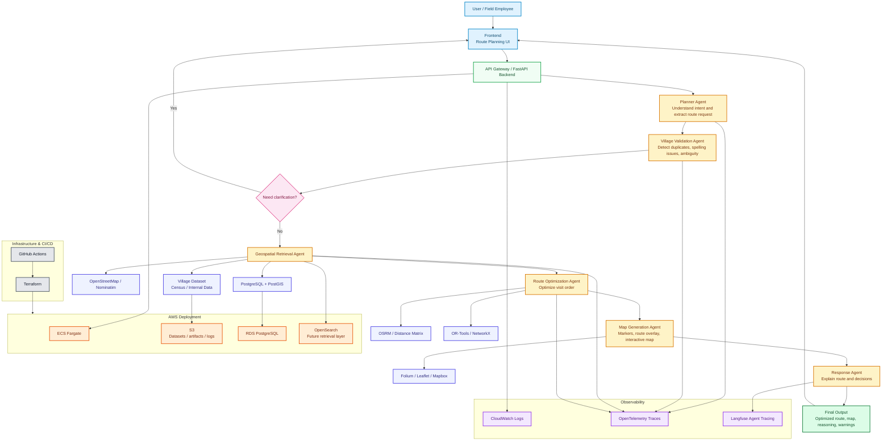

# Agentic-Geospatial-Route-Planner
I noticed field agents spend hours manually planning village visits. Google Maps doesn't understand the operational constraints. I started building an Agentic AI Route Planner that retrieves village data, validates locations, and optimizes routes automatically.

## Architecture

