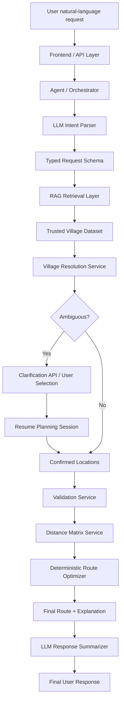

# Final Architecture

## Principle

- LLM handles understanding and orchestration.
- RAG retrieves from the trusted village dataset.
- Deterministic services validate coordinates and compute routes.
- Ambiguity triggers user clarification before route optimization.
